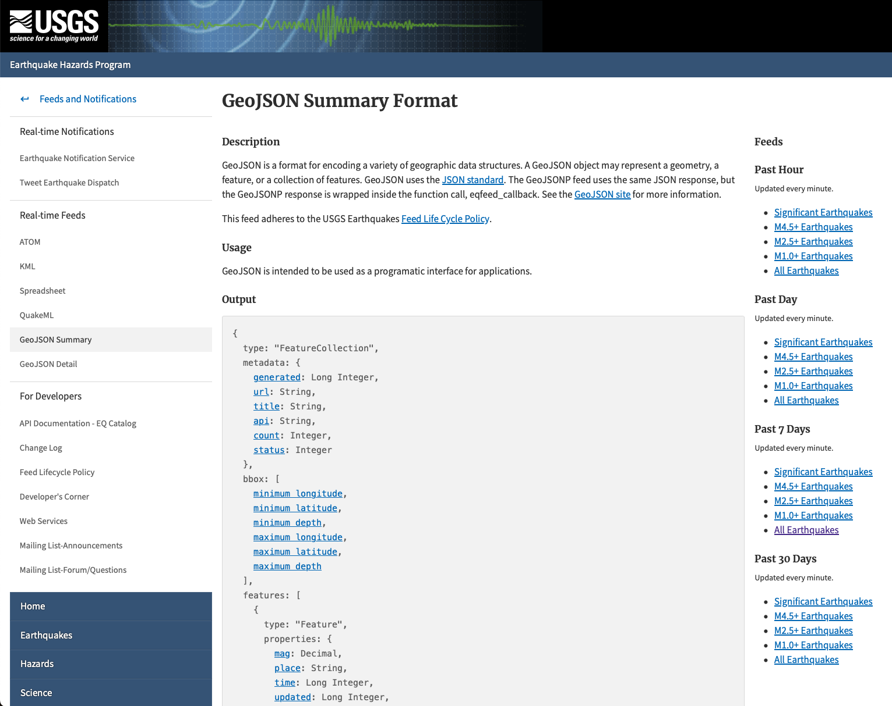
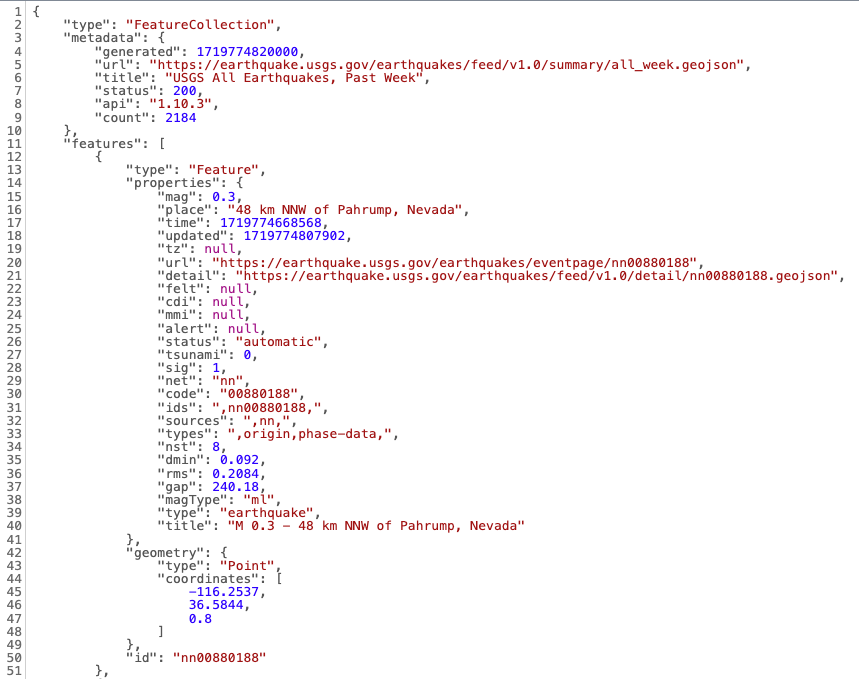
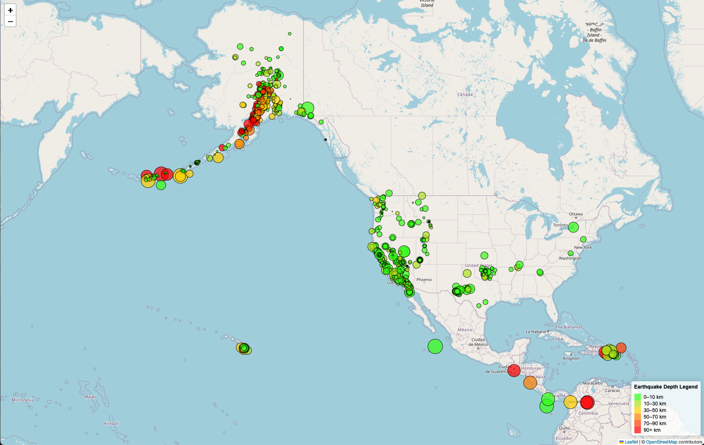
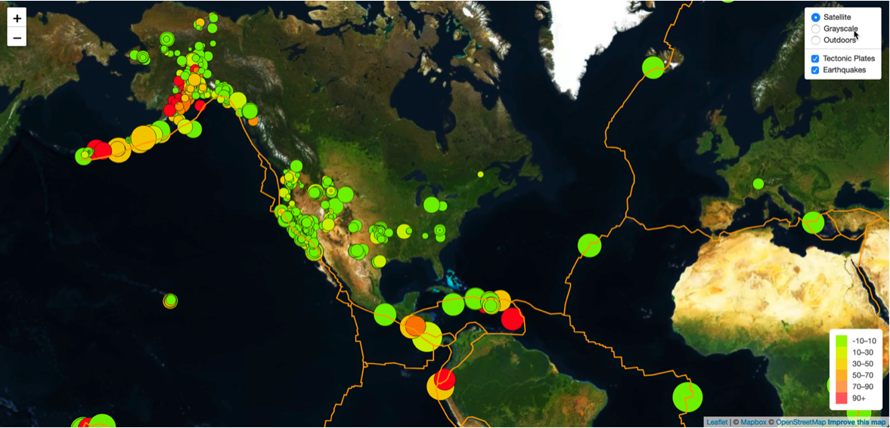

# leaflet-challenge
Module 15 Challenge

Welcome to the Leaflet Earthquake Visualization GitHub repository! This project visualizes earthquake data provided by the United States Geological Survey (USGS) using interactive maps built with Leaflet.

## Background
The USGS is responsible for providing scientific data about natural hazards, ecosystem and environmental health, and the impacts of climate and land-use change. They are interested in building new tools to visualize their earthquake data to better educate the public and other government organizations.

## Repository Structure

- **index.html**: The main HTML document.
- **Leaflet-Part-1/static
    - **css/style.css**: Contains styles for the visualization.
    - **js/logic-lee.js**: Contains JavaScript code for fetching data and building visualizations.
- **images**: Contains screenshots of images for the README.

## Instructions
The instructions for this activity were broken into two parts:
* Part 1: Create the Earthquake Visualization
* Part 2: Gather and Plot More Data (Optional)
> **Note:** Part 2 was not completed and will be completed at a later date.

### Part 1: Create the Earthquake Visualization

The first task was to visualize an earthquake dataset. The following steps were completed:

1. **Get the dataset:**
    * The USGS provides earthquake data in various formats, updated every 5 minutes. The [USGS GeoJSON Feed](https://earthquake.usgs.gov/earthquakes/feed/v1.0/geojson.php) page was visited and a dataset was chosen to visualize. The "All Earthquakes from the Past 7 Days" dataset was used.
    * Example screenshot of the dataset selection page:
       
    * Upon clicking a dataset (such as "All Earthquakes from the Past 7 Days"), a JSON representation of that data was provided. The URL of this JSON was used to pull in the data for the visualization by expliciting adding the URL to the `logic-lapreze.js` file.
    * Example screenshot of earthquake data in JSON format:
       

2. **Import and visualize the data:**
    * Using Leaflet, a map was created that plots all the earthquakes from the dataset based on their longitude and latitude.
    * Data markers were designed to reflect the magnitude of the earthquake by their size and the depth of the earthquake by color. Earthquakes with higher magnitudes appear larger, and earthquakes with greater depth appear darker in color.
    * Hovering over the marker will display a tooltip with the earthquake magnitude, location, and depth.
    * Popups were included to provide additional information about the earthquake when its associated marker is clicked.
    * A legend was created to provide context for the map data.
    * Example of the map visualization:
       

### Part 2: Gather and Plot More Data (Optional)
> **Note:** This part was not completed and will be completed at a later date.

#### Objective:
Plot a second dataset on the map to illustrate the relationship between tectonic plates and seismic activity.

1. **Pull in the tectonic plates dataset:**
    *Data on tectonic plates can be found at [tectonic plates dataset](https://github.com/fraxen/tectonicplates).

2. **Visualize the data:**
    * Plot the tectonic plates dataset on the map in addition to the earthquakes.
    * Add other base maps to choose from.
    * Put each dataset into separate overlays that can be turned on and off independently.
    * Add layer controls to the map.
    * Example of the combined map visualization:
       
